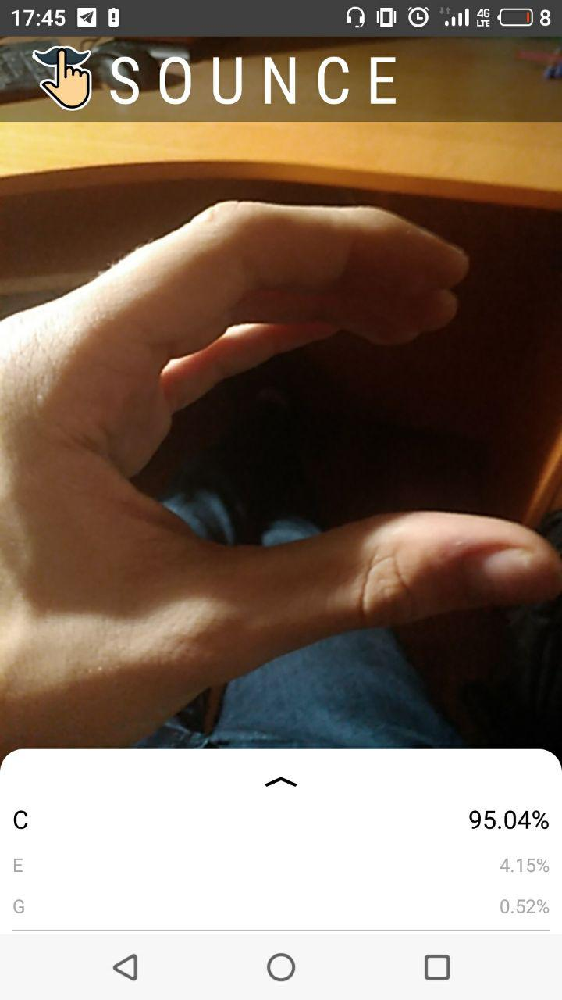
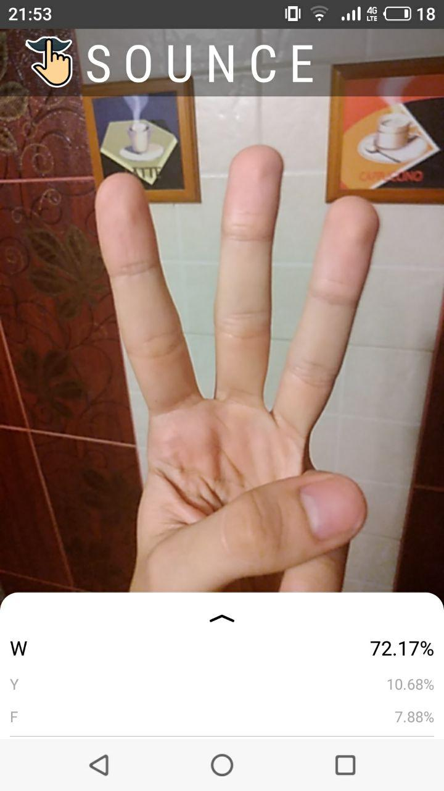
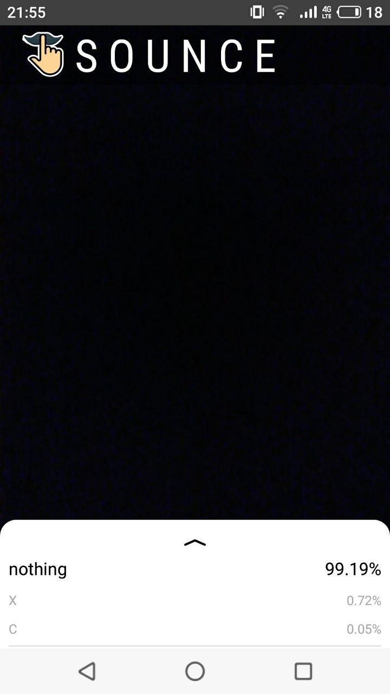

Sounce - test android prototype
===================================
 

Introduction
--------------
This sample is a remake of the [example from TensorFlow](https://github.com/tensorflow/examples) and designed to test the neural network. UI is still under development, so any ideas are welcome :)

 Requirements
--------------

*   Android Studio 3.2 (installed on a Linux, Mac or Windows machine)

*   Android device in
    [developer mode](https://developer.android.com/studio/debug/dev-options)
    with USB debugging enabled

*   USB cable (to connect Android device to your computer)

Screenshots
-------------
 
 
 

Getting Started
---------------

This sample uses the Gradle build system. To build this project, use the
"gradlew build" command or use "Import Project" in Android Studio.

Support
-------

- Stack Overflow: http://stackoverflow.com/questions/tagged/android

If you've found an error in this sample, please file an issue:
https://github.com/Sounce/sounce-mobile

Changes are encouraged, and may be submitted by forking this project and
submitting a pull request through GitHub. Please see CONTRIBUTING.md for more details.